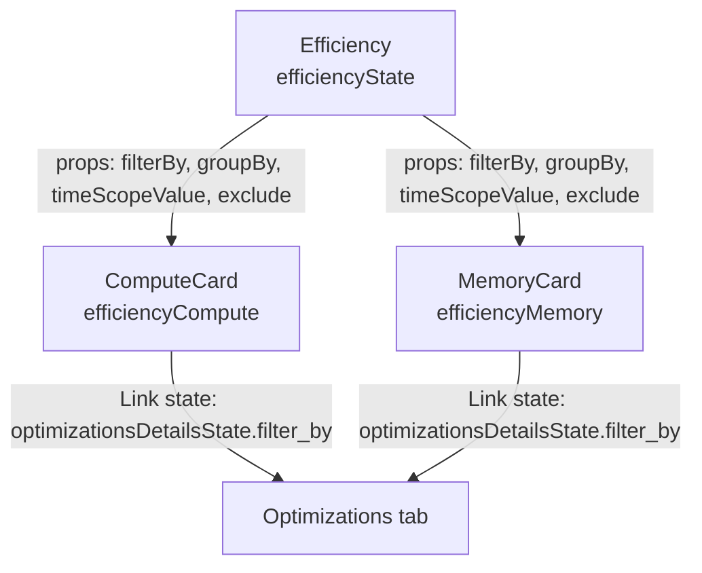
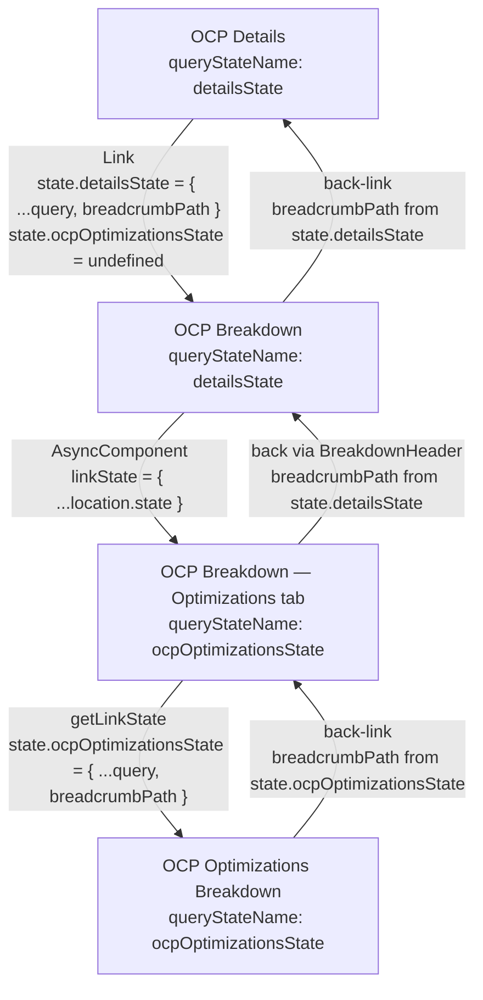
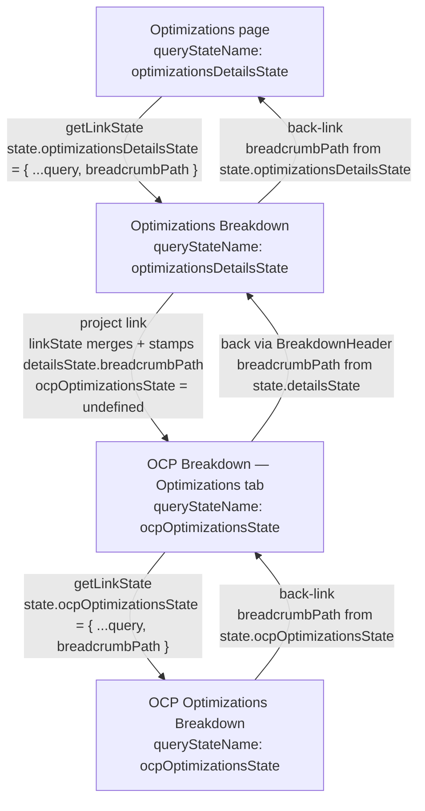

# Cross-Page State Navigation

This document describes how `koku-ui-hccm` and `koku-ui-ros` collaborate to preserve filter state and breadcrumb paths as users navigate between pages and tabs. The mechanism is built entirely on React Router's `location.state` — no URL query parameters or global Redux state are used for this purpose.

---

## Core Concepts

### Why `location.state`?

Filter state (which clusters, projects, or workloads the user has selected) must survive navigation without appearing in the URL. Using `location.state` means:

- Filters are invisible to bookmarks and shared links (intentional — filters are session-scoped).
- Each page independently owns its filter slot and can restore it on mount.
- Breadcrumb back-links carry the full state forward, so pressing "back" restores the exact filter context.

### `getQueryState` — reading a named slot

```typescript
// apps/koku-ui-hccm/src/routes/utils/queryState.ts
export function getQueryState(location: H.Location, key: string) {
  return location?.state?.[key] ? cloneDeep(location?.state[key]) : undefined;
}
```

Every page that owns a filter slot calls `getQueryState(location, queryStateName)` during its initial render. If the slot is present (the user navigated back), the saved query is used as the initial state; otherwise the component starts from its `baseQuery` default.

### `getLinkState` — building the next `linkState`

```typescript
// apps/koku-ui-ros/src/routes/optimizations/optimizationsTable/utils.tsx
export const getLinkState = ({ breadcrumbPath, linkState, location, query, queryStateName }) => {
  return {
    ...(location?.state || {} ),                   // 1. preserve all existing state slots
    ...(linkState || {}),                          // 2. apply overrides from the hccm parent
    ...(queryStateName && {
      [queryStateName]: {
        ...(linkState?.[queryStateName] || {}),    // 3. carry parent-supplied slot values
        ...(breadcrumbPath && { breadcrumbPath }), // 4. stamp the back-link URL
        ...(query || {}),                          // 5. embed current filter/sort/page query
      },
    }),
  };
};
```

`getLinkState` is called inside a `useEffect([query])` hook in `OptimizationsTable`. Every time the user changes a filter, sort, or page, the effect runs and computes a fresh `newLinkState` — so the `Link` components in the table rows always carry up-to-date filter state to the next page.

---

## The Two Roles

| Responsibility | `koku-ui-hccm` | `koku-ui-ros` |
|---|---|---|
| Route definitions and page shells | Yes | No |
| Choosing `queryStateName` | Yes — hardcoded per page | Receives as prop, never chooses |
| Building initial `linkState` | Yes — at the Link/AsyncComponent boundary | No |
| Restoring query from `location.state` | `getQueryState` in page components | `getQueryState` in `OptimizationsTable` |
| Merging query into outgoing `linkState` | No | `getLinkState` in `OptimizationsTable` |
| Rendering breadcrumb back-link | `BreakdownHeader` (reads `location.state[queryStateName].breadcrumbPath`) | `OptimizationsBreakdownHeader` (reads `location.state[queryStateName].breadcrumbPath`) |
| Stamping `breadcrumbPath` | hccm wrappers (e.g., `OptimizationsBreakdown`) can override it | `getLinkState` stamps it from `breadcrumbPath` prop |

---

## `queryStateName` Values

Each page that owns filter state declares a `queryStateName`. This string is the key used to read and write the filter slot inside `location.state`.

| Page / Component | `queryStateName` | Declared in |
|---|---|---|
| OCP Details | `"detailsState"` | `detailsTable.tsx` (built into `linkState`) |
| OCP Breakdown | `"detailsState"` | `ocpBreakdown.tsx` → `BreakdownBase` |
| OCP Breakdown — Optimizations tab | `"ocpOptimizationsState"` | `ocpOptimizations.tsx` → `AsyncComponent` |
| OCP Optimizations Breakdown | `"ocpOptimizationsState"` | `ocpOptimizationsBreakdown.tsx` → `AsyncComponent` |
| Optimizations page | `"optimizationsDetailsState"` | `optimizationsDetails.tsx` (hccm) → `AsyncComponent` |
| Optimizations Breakdown | `"optimizationsDetailsState"` | `optimizationsBreakdown.tsx` (hccm) → `AsyncComponent` |
| Efficiency tab (toolbar) | `"efficiencyState"` | `efficiency.tsx` (carries `activeTabKey` + toolbar query) |
| Efficiency tab — CPU table | `"efficiencyCompute"` | `computeCard.tsx` (sort + pagination) |
| Efficiency tab — Memory table | `"efficiencyMemory"` | `memoryCard.tsx` (sort + pagination) |

The `BreakdownBase` component in `koku-ui-hccm` uses `queryStateName` to locate the breadcrumb path:

```typescript
// breakdownBase.tsx
breadcrumbPath={router?.location?.state?.[queryStateName]?.breadcrumbPath || breadcrumbPath}
```

The `OptimizationsBreakdown` component in `koku-ui-ros` does the same:

```typescript
// optimizationsBreakdown.tsx (ros)
breadcrumbPath: location?.state?.[queryStateName]?.breadcrumbPath,
```

---

## `location.state` Shape

The full state object is a flat namespace where every page's slot coexists. All slots are optional; a page only reads the slot it owns.

```typescript
interface LocationState {
  // OCP Details page filter state
  detailsState?: {
    filter_by?: Record<string, string | string[]>;
    exclude?: Record<string, string | string[]>;
    group_by?: Record<string, string>;
    order_by?: Record<string, string>;
    breadcrumbPath?: string; // URL back to OCP details page
  };

  // OCP Breakdown — Optimizations tab filter state
  ocpOptimizationsState?: {
    filter_by?: Record<string, string | string[]>;
    limit?: number;
    offset?: number;
    order_by?: Record<string, string>;
    breadcrumbPath?: string; // URL back to OCP breakdown (optimizations tab active)
  };

  // Optimizations page filter state
  optimizationsDetailsState?: {
    filter_by?: Record<string, string | string[]>;
    limit?: number;
    offset?: number;
    order_by?: Record<string, string>;
    breadcrumbPath?: string; // URL back to Optimizations breakdown page
  };

  // Efficiency tab — toolbar and active tab control
  efficiencyState?: {
    activeTabKey?: number; // 0 = efficiency tab, 1 = optimizations tab
    filter_by?: Record<string, string | string[]>;
    exclude?: Record<string, string | string[]>;
    group_by?: Record<string, string>;
    filter?: { time_scope_value?: number; [key: string]: any };
    order_by?: Record<string, string>;
  };

  // Efficiency tab — CPU table independent sort + pagination
  efficiencyCompute?: {
    filter?: { limit?: number; offset?: number; time_scope_value?: number; [key: string]: any };
    order_by?: Record<string, string>;
  };

  // Efficiency tab — Memory table independent sort + pagination
  efficiencyMemory?: {
    filter?: { limit?: number; offset?: number; time_scope_value?: number; [key: string]: any };
    order_by?: Record<string, string>;
  };
}
```

Because every `Link` and every `navigate()` call spreads the entire existing `location.state`, all slots accumulate as the user moves deeper in the navigation chain. A page only writes its own slot; it never overwrites slots belonging to other pages.

---

## AsyncComponent Prop Reference

The `AsyncComponent` (from `@redhat-cloud-services/frontend-components`) renders a federated module from `koku-ui-ros`. Two props are used for state coordination:

| Prop | Type | Purpose |
|---|---|---|
| `queryStateName` | `string` | The key under which the federated component reads and writes its filter state in `location.state`. Chosen by the hccm parent. |
| `linkState` | `object` | The full `location.state` object (plus any overrides) forwarded into the federated module. The module stores it and passes it through every outgoing `Link`. |

### `OptimizationsDetails` props (used by Optimizations page and OCP Breakdown)

| Prop | Type | Description |
|---|---|---|
| `breadcrumbLabel` | `string` | Text for the breadcrumb back-link |
| `breadcrumbPath` | `string` | URL the back-link navigates to |
| `isHeaderHidden` | `boolean` | Hides the page header when embedded in a tab |
| `linkPath` | `string` | Base path for the Optimizations breakdown page |
| `linkState` | `object` | Full `location.state` passed through to breakdown links |
| `queryStateName` | `string` | Named slot used to save/restore filter state |

### `OptimizationsBreakdown` props (used by Optimizations Breakdown and OCP Optimizations Breakdown)

| Prop | Type | Description |
|---|---|---|
| `linkState` | `object` | Full `location.state` forwarded to the breadcrumb back-link |
| `projectPath` | `string` | OCP Breakdown base path; enables the "project" link in the header (Scenario B only) |
| `queryStateName` | `string` | Named slot used to read `breadcrumbPath` |

### `OptimizationsOcpBreakdown` / `OptimizationsTable` props (used inside OCP Breakdown optimizations tab)

| Prop | Type | Description |
|---|---|---|
| `breadcrumbLabel` | `string` | Text for the breadcrumb back-link |
| `breadcrumbPath` | `string` | URL the back-link navigates to (OCP breakdown URL) |
| `cluster` | `string` | Cluster filter pre-applied when arriving from a cluster-scoped breakdown |
| `isClusterHidden` | `boolean` | Hides the cluster column when a single cluster is already filtered |
| `isProjectHidden` | `boolean` | Hides the project column when a single project is already filtered |
| `linkPath` | `string` | Base path for the OCP Optimizations breakdown page |
| `linkState` | `object` | Full `location.state` forwarded through table row links |
| `project` | `string` | Project filter pre-applied when arriving from a project-scoped breakdown |
| `queryStateName` | `string` | Named slot (`"ocpOptimizationsState"`) used to save/restore filter state |

---

## Efficiency Tab: CPU and Memory Cards

The efficiency tab renders two cards side-by-side — `ComputeCard` (CPU) and `MemoryCard` (memory). Each card owns its own independent sort and pagination state so that sorting one table does not affect the other.

### Architecture



### What each layer owns

| State | Owner | Slot | Persisted to `location.state`? |
|---|---|---|---|
| Date range, group by, filter chips | `Efficiency` (toolbar) | `efficiencyState` | Yes — written on every query change via `navigate({ replace: true })` |
| CPU table sort + pagination | `ComputeCard` | `efficiencyCompute` | Read on mount; **not currently written back** |
| Memory table sort + pagination | `MemoryCard` | `efficiencyMemory` | Read on mount; **not currently written back** |

The toolbar state (date range, group by, applied filters) is owned by `efficiency.tsx` and propagated down to both cards as props (`filterBy`, `groupBy`, `timeScopeValue`, `exclude`). Because `efficiency.tsx` writes its query to `location.state` on every change, the toolbar state is always available for restoration.

The sort and pagination state of each card is managed in local React component state (`useState`). Each card calls `getQueryState` at mount to read its slot, but no code currently writes those slots back to `location.state`.

### State lifecycle within the efficiency tab

While the user stays on the efficiency tab, both cards remain mounted and their local sort/pagination state is preserved in memory. Tab-switching in the `optimizations.tsx` parent uses conditional rendering:

```tsx
{activeTabKey === 0 && <Efficiency />}
{activeTabKey === 1 && <OptimizationsDetails ... />}
```

When the user switches to the optimizations tab and then returns, `<Efficiency />` unmounts and remounts. On remount:

- `efficiency.tsx` restores its toolbar query from `location.state.efficiencyState` → the group by, filters, and date range are intact.
- `ComputeCard` calls `getQueryState(location, 'efficiencyCompute')` → `undefined` (slot is never written) → sort and page reset to `baseQuery`.
- `MemoryCard` calls `getQueryState(location, 'efficiencyMemory')` → `undefined` → sort and page reset to `baseQuery`.
- Both cards receive the restored toolbar props from `efficiency.tsx`, so the correct filter rows are still applied to the report fetch.

### Navigating from a card row to the optimizations tab

Each card renders an `EfficiencyTable`. When the user clicks a row link, `EfficiencyTable` navigates to the optimizations page (same route, `replace: true`) with a `state` that:

1. Spreads the entire current `location.state` (preserving all existing slots).
2. Sets `efficiencyState.activeTabKey = 1` — causes `optimizations.tsx` to show the optimizations tab.
3. Sets `optimizationsDetailsState.filter_by` to filter the optimizations table to the clicked cluster or project.

```typescript
// efficiencyTable.tsx — Link state for each row
state={{
  ...(location?.state || {}),
  efficiencyState: {
    ...(location?.state?.efficiencyState || {}),
    activeTabKey: 1,                  // switch to optimizations tab
  },
  optimizationsDetailsState: {
    ...(location?.state?.optimizationsDetailsState || {}),
    filter_by: {
      [groupBy]: [label],             // pre-filter optimizations by this cluster/project
    },
  },
}}
```

The `efficiencyCompute` and `efficiencyMemory` slots are not included in this state, so card sort/pagination is not carried to the optimizations tab and resets to default when the user returns to the efficiency tab.

### Extending card state persistence

To persist card sort and pagination across tab switches, each card would need to write its query to `location.state` on every change, using the same `navigate({ replace: true })` pattern as `efficiency.tsx`:

```typescript
// Pattern to add to ComputeCard / MemoryCard
useEffect(() => {
  navigate(`${location.pathname}${location.search}`, {
    replace: true,
    state: {
      ...(location?.state || {}),
      efficiencyCompute: { ...query },  // or efficiencyMemory for MemoryCard
    },
  });
}, [query]);
```

The `EfficiencyTable` row links would also need to include the current card state in their `state` prop so the slot survives the tab-switch navigation.

---

## Scenario A: OCP Details → OCP Breakdown → Optimizations Tab → OCP Optimizations Breakdown

### Navigation flow



### Step-by-step state

**Step 1 — OCP Details: user clicks a row link**

`detailsTable.tsx` builds the `linkState` for every row:

```typescript
const linkState = {
  ...(router?.location?.state || {}),  // carry existing slots
  detailsState: {
    ...(query || {}),                  // current filter_by, group_by, order_by, etc.
    breadcrumbPath,                    // URL back to the OCP details page
  },
  ocpOptimizationsState: undefined,    // reset — forces the optimizations tab to reinitialize
};
```

The same `linkState` is passed both to the `<Link>` for the row name and to the `AsyncComponent linkState` prop for the optimizations count link.

**Step 2 — OCP Breakdown: breadcrumb back-link is wired**

`ocpBreakdown.tsx` passes `queryStateName="detailsState"` to `BreakdownBase`. `BreakdownHeader` resolves the back-link as:

```typescript
router?.location?.state?.['detailsState']?.breadcrumbPath
```

`mapStateToProps` also reads `detailsState` to reconstruct the report query:

```typescript
const queryState = getQueryState(router.location, 'detailsState');
// queryState.filter_by and queryState.exclude are applied to the OCP report query
```

**Step 3 — User clicks the Optimizations tab**

`OcpOptimizations` renders the `AsyncComponent` with:

```typescript
<AsyncComponent
  scope="costManagementRos"
  module="./OptimizationsOcpBreakdown"      // or ./OptimizationsTable
  breadcrumbPath={formatPath(`${routes.ocpBreakdown.path}${location.search}${optimizationsTab}`)}
  linkPath={formatPath(routes.ocpOptimizationsBreakdown.path)}
  linkState={{ ...location?.state }}        // full state forwarded unchanged
  queryStateName="ocpOptimizationsState"
/>
```

**Step 4 — Optimizations tab: user applies a filter, state is updated**

`OptimizationsTable` (ros) calls `getQueryState(location, "ocpOptimizationsState")` on mount — finding `undefined` (it was reset in step 1), so it starts from `baseQuery`. Each filter change triggers:

```typescript
useEffect(() => {
  setNewLinkState(getLinkState({
    breadcrumbPath,   // OCP breakdown URL with optimizationsTab=true
    linkState,        // { ...location.state } from hccm parent
    location,
    query,            // current filter state in this table
    queryStateName,   // "ocpOptimizationsState"
  }));
}, [query]);
```

`getLinkState` produces:

```typescript
{
  detailsState: { ...savedOcpDetailsFilters, breadcrumbPath: '<ocp-details-url>' },
  ocpOptimizationsState: {
    filter_by: { ... },   // user's current filter
    limit: 10,
    offset: 0,
    order_by: { last_reported: 'desc' },
    breadcrumbPath: '<ocp-breakdown-url>?...&optimizationsTab=true',
  },
}
```

**Step 5 — User clicks a row link → OCP Optimizations Breakdown**

`OptimizationsDataTable` renders each row's link as:

```typescript
<Link to={optimizationsBreakdownPath} state={newLinkState}>
  {container}
</Link>
```

`newLinkState` (from step 4) carries both `detailsState` and `ocpOptimizationsState`.

**Step 6 — OCP Optimizations Breakdown: back-link**

`OcpOptimizationsBreakdown` (hccm wrapper) passes `queryStateName="ocpOptimizationsState"` to `AsyncComponent`. Inside ros, `OptimizationsBreakdown` reads:

```typescript
breadcrumbPath: location?.state?.['ocpOptimizationsState']?.breadcrumbPath
```

This navigates back to the OCP breakdown page with `optimizationsTab=true`.

**Step 7 — Back to Optimizations tab**

`OptimizationsTable` calls `getQueryState(location, "ocpOptimizationsState")` and restores the filter. The same filter chips are displayed.

**Step 8 — Back to OCP Breakdown**

`BreakdownHeader` reads `location.state.detailsState.breadcrumbPath` for its back-link, navigating to the OCP details page.

**Step 9 — Back to OCP Details**

The OCP details page re-reads `detailsState` (via `mapStateToProps` calling `getQueryState`). The original filter is restored.

---

## Scenario B: Optimizations → Optimizations Breakdown → OCP Breakdown → OCP Optimizations Breakdown

### Navigation flow



### Step-by-step state

**Step 1 — Optimizations: user clicks a row link**

`OptimizationsDetails` (hccm) passes to `AsyncComponent`:

```typescript
<AsyncComponent
  scope="costManagementRos"
  module="./OptimizationsDetails"
  breadcrumbPath={formatPath(`${routes.optimizations.path}${location.search}`)}
  linkPath={formatPath(routes.optimizationsBreakdown.path)}
  linkState={{
    ...(location?.state || {}),
    efficiencyState: {
      ...(location?.state?.efficiencyState || {}),
      activeTabKey,    // preserves which tab (efficiency vs optimizations) was active
    },
  }}
  queryStateName="optimizationsDetailsState"
/>
```

`OptimizationsTable` (ros) calls `getQueryState(location, "optimizationsDetailsState")` to restore state. On each filter change, `getLinkState` updates `state.optimizationsDetailsState`:

```typescript
{
  efficiencyState: { activeTabKey: 1 },
  optimizationsDetailsState: {
    filter_by: { ... },   // user's current filter
    limit: 10,
    offset: 0,
    breadcrumbPath: '<optimizations-breakdown-url>?...',
  },
}
```

**Step 2 — User clicks a row link → Optimizations Breakdown**

`OptimizationsDataTable` renders each row's link with `newLinkState`.

`OptimizationsBreakdown` (hccm wrapper) adds one further modification before passing to `AsyncComponent`:

```typescript
<AsyncComponent
  scope="costManagementRos"
  module="./OptimizationsBreakdown"
  linkState={{
    ...(location?.state || {}), 
    // When user clicks the optimizations breakdown "project" link, the user navigates to the OCP breakdown page
    // The properties below are overridden to initialize the optimizations tab and breadcrumb path for that page
    detailsState: {
      ...(location?.state?.detailsState || {}),
      // Breadcrumb should return to optimizations breakdown
      breadcrumbPath: formatPath(`${routes.optimizationsBreakdown.path}${location.search}`),
    },
    ocpOptimizationsState: undefined, // Clear state to initialize optimizations tab
  }}
  projectPath={formatPath(routes.ocpBreakdown.path)}
  queryStateName="optimizationsDetailsState"
/>
```

This stamps `detailsState.breadcrumbPath` with the current Optimizations Breakdown URL so that when the user reaches the OCP breakdown, its breadcrumb can point back here.

**Step 3 — Optimizations Breakdown: the "project" link**

`OptimizationsBreakdownHeader` (ros) renders the "project" link via `OptimizationsBreakdownProjectLink`. This component builds:

```typescript
const newLinkState = {
  ...(location?.state || {}),  // all existing slots (including optimizationsDetailsState and detailsState)
  ...linkState,                // overrides from hccm (detailsState.breadcrumbPath already stamped)
};
```

It navigates to the OCP breakdown path with `isOptimizationsTab=true` query param, carrying the full merged state.

**Step 4 — OCP Breakdown — Optimizations tab**

`OcpOptimizations` (hccm) renders the `AsyncComponent` with:

- `queryStateName="ocpOptimizationsState"` — a fresh slot; `undefined` because it was cleared in step 2
- `linkState={{ ...location.state }}` — full state, including `optimizationsDetailsState` and `detailsState`

`OptimizationsTable` starts from `baseQuery` (no saved `ocpOptimizationsState`). As the user filters, `getLinkState` builds:

```typescript
{
  ...(location?.state || {}),
  ocpOptimizationsState: {
    filter_by: { ... },
    breadcrumbPath: '<ocp-breakdown-url>?...&optimizationsTab=true',
  },
}
```

**Step 5 — User clicks a row link → OCP Optimizations Breakdown**

Same as Scenario A step 5. `newLinkState` carries all four slots.

**Step 6 — OCP Optimizations Breakdown: back-link**

`OptimizationsBreakdown` (ros) reads `location.state.ocpOptimizationsState.breadcrumbPath` — the OCP breakdown URL with `optimizationsTab=true`.

**Step 7 — Back to OCP Breakdown Optimizations tab**

`OptimizationsTable` calls `getQueryState(location, "ocpOptimizationsState")` and restores the filter.

**Step 8 — Back to Optimizations Breakdown**

`BreakdownHeader` (hccm) reads `location.state.detailsState.breadcrumbPath` — the Optimizations Breakdown URL stamped in step 2.

**Step 9 — Back to Optimizations page**

`OptimizationsBreakdownHeader` (ros) reads `location.state.optimizationsDetailsState.breadcrumbPath` — the Optimizations page URL. Navigating there restores the `efficiencyState.activeTabKey` so the correct tab (efficiency or optimizations) is re-activated.

**Step 10 — Optimizations page: filter restored**

`OptimizationsTable` calls `getQueryState(location, "optimizationsDetailsState")` and restores `filter_by`. The same filter chips are displayed.

---

## State Lifecycle Rules

1. **A page initializes its query from `getQueryState`** — if the slot is present the saved state wins; otherwise `baseQuery` is used.
2. **A page writes its query into `location.state` via `navigate({ replace: true, state: ... })`** — for the Efficiency page this happens in a `useEffect([query])` hook.
3. **`OptimizationsTable` writes its query into the outgoing `linkState` via `getLinkState`** — this happens in a `useEffect([query])` hook so the link state is always current.
4. **Every `Link` and `navigate()` call spreads the entire existing `location.state`** — individual pages never drop slots owned by other pages.
5. **A slot is deliberately reset by setting it to `undefined`** — `detailsTable.tsx` does this for `ocpOptimizationsState` so the optimizations tab always reinitializes when the user arrives from OCP details; `optimizationsBreakdown.tsx` does the same.
6. **`breadcrumbPath` is stamped at the moment of departure** — the hccm wrapper or `getLinkState` sets the URL at the time the user clicks the link, ensuring the path is always accurate even if the URL has changed since the component mounted.

---

## File Map

```
koku-ui-hccm/src/
├── routes/
│   ├── utils/
│   │   └── queryState.ts                    # getQueryState / clearQueryState
│   ├── details/
│   │   ├── ocpDetails/
│   │   │   └── detailsTable.tsx             # builds linkState with "detailsState"
│   │   ├── ocpBreakdown/
│   │   │   ├── ocpBreakdown.tsx             # queryStateName="detailsState"
│   │   │   └── optimizations/
│   │   │       ├── ocpOptimizations.tsx     # queryStateName="ocpOptimizationsState"
│   │   │       └── ocpOptimizationsBreakdown.tsx  # queryStateName="ocpOptimizationsState"
│   │   └── components/
│   │       └── breakdown/
│   │           ├── breakdownBase.tsx        # reads location.state[queryStateName].breadcrumbPath
│   │           └── breakdownHeader.tsx      # renders back-link and filter chips
│   └── optimizations/
│       ├── optimizationsDetails/
│       │   └── optimizationsDetails.tsx     # queryStateName="optimizationsDetailsState"
│       ├── optimizationsBreakdown/
│       │   └── optimizationsBreakdown.tsx   # queryStateName="optimizationsDetailsState"
│       │                                    # stamps detailsState.breadcrumbPath
│       └── efficiency/
│           ├── efficiency.tsx               # queryStateName="efficiencyState"; writes toolbar
│           │                                # query to location.state on every change
│           ├── efficiencyTable.tsx          # Link state sets activeTabKey + optimizationsDetailsState
│           ├── compute/
│           │   └── computeCard.tsx          # reads efficiencyCompute slot; owns sort+pagination
│           └── memory/
│               └── memoryCard.tsx           # reads efficiencyMemory slot; owns sort+pagination

koku-ui-ros/src/
└── routes/
    └── optimizations/
        ├── optimizationsTable/
        │   ├── optimizationsTable.tsx       # getQueryState + getLinkState
        │   ├── optimizationsDataTable.tsx   # <Link state={newLinkState}>
        │   └── utils.tsx                    # getLinkState()
        ├── optimizationsDetails/
        │   └── optimizationsDetails.tsx     # receives queryStateName + linkState as props
        ├── optimizationsBreakdown/
        │   ├── optimizationsBreakdown.tsx   # reads location.state[queryStateName].breadcrumbPath
        │   ├── optimizationsBreakdownHeader.tsx  # renders back-link; passes linkState to project link
        │   └── optimizationsBreakdownProjectLink.tsx  # merges linkState for OCP breakdown navigation
        └── optimizationsOcpBreakdown/
            └── optimizationsOcpBreakdown.tsx  # receives queryStateName + linkState as props
```
