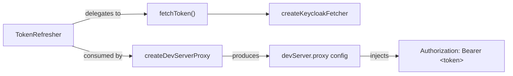
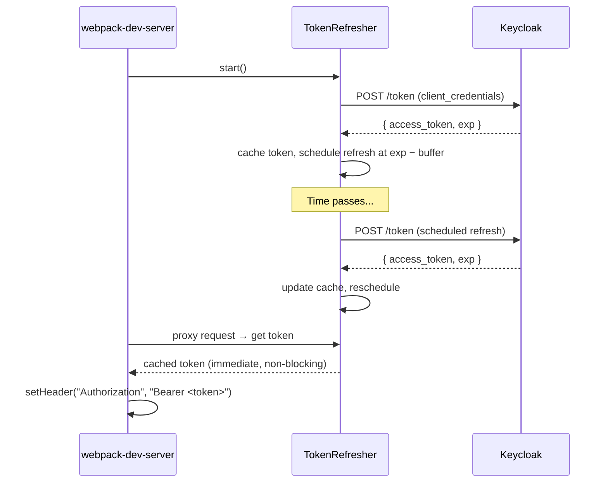

# @koku-ui/token-refresher

Dev-only JWT token refresher for webpack-dev-server proxy configurations. Keeps
an OAuth2 access token fresh in the background so that `devServer.proxy` requests
are always authenticated — no manual token copy-paste, no fixed-interval polling.

## Architecture

Three layers, each usable independently:



| Layer | Responsibility |
|-------|----------------|
| **`TokenRefresher`** | Generic cache + adaptive scheduling. Reads JWT `exp`, computes next refresh, serves stale tokens while revalidating. |
| **`createKeycloakFetcher`** | Keycloak `client_credentials` grant via the Fetch API. Returns a `() => Promise<string>` plugged into `TokenRefresher`. |
| **`createDevServerProxy`** | Builds a complete `devServer.proxy[]` entry with `onProxyReq` wired to inject the bearer token. |

## Token lifecycle



## Usage

```typescript
import {
  TokenRefresher,
  createKeycloakFetcher,
  createDevServerProxy,
} from '@koku-ui/token-refresher';

const refresher = new TokenRefresher({
  fetchToken: createKeycloakFetcher({
    tokenUrl: process.env.KEYCLOAK_TOKEN_URL,
    clientId: process.env.KEYCLOAK_CLIENT_ID,
    clientSecret: process.env.KEYCLOAK_CLIENT_SECRET,
  }),
  fallbackToken: process.env.API_TOKEN,
});
refresher.start();

// In webpack config:
const config = {
  devServer: {
    proxy: [
      createDevServerProxy(refresher, {
        context: ['/api/cost-management/v1'],
        target: process.env.API_PROXY_URL,
        pathRewrite: { '^/api/cost-management/v1': '' },
      }),
    ],
  },
};
```

## API reference

### `TokenRefresher`

```typescript
new TokenRefresher(options: TokenRefresherOptions)
```

| Option | Type | Default | Description |
|--------|------|---------|-------------|
| `fetchToken` | `() => Promise<string>` | *required* | Async function that returns a JWT string. |
| `fallbackToken` | `string` | `''` | Static token used before the first fetch completes. |
| `refreshBufferSec` | `number` | `60` | Seconds before `exp` to trigger the next refresh. |
| `logger` | `(msg: string) => void` | `console.log` | Log sink for refresh/error messages. |

**Methods:** `start()`, `stop()`, `get token: string`

### `createKeycloakFetcher`

```typescript
createKeycloakFetcher(options: KeycloakFetcherOptions): () => Promise<string>
```

| Option | Type | Description |
|--------|------|-------------|
| `tokenUrl` | `string` | Full Keycloak token endpoint URL. |
| `clientId` | `string` | OAuth2 client ID. |
| `clientSecret` | `string` | OAuth2 client secret. |

For self-signed certificates, set `NODE_TLS_REJECT_UNAUTHORIZED=0` in your environment.

### `createDevServerProxy`

```typescript
createDevServerProxy(refresher: TokenRefresher, options: DevServerProxyOptions): WebpackDevServer.ProxyConfigArrayItem
```

| Option | Type | Default | Description |
|--------|------|---------|-------------|
| `context` | `string \| string[]` | *required* | URL paths to proxy. |
| `target` | `string` | *required* | Backend URL. |
| `pathRewrite` | `Record<string, string>` | — | Path rewrite rules. |
| `changeOrigin` | `boolean` | `true` | Change `Host` header to target. |
| `secure` | `boolean` | `true` | Verify target TLS certificate. |

## Running tests

```bash
npm test -w @koku-ui/token-refresher
```

Or directly:

```bash
cd libs/token-refresher
node --experimental-strip-types --experimental-test-module-mocks --test 'test/**/*.test.ts'
```
